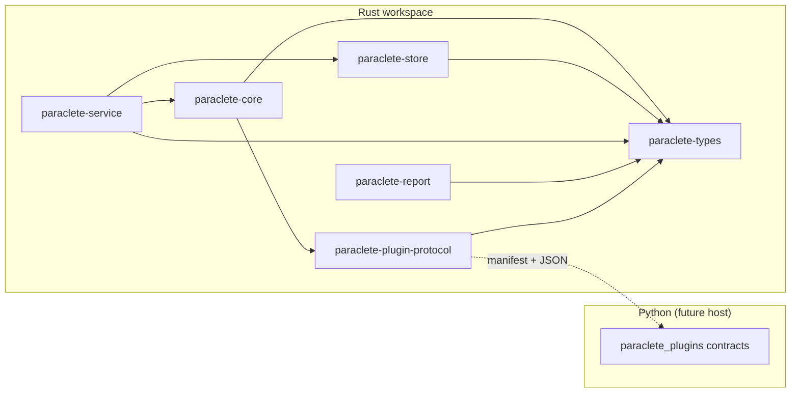
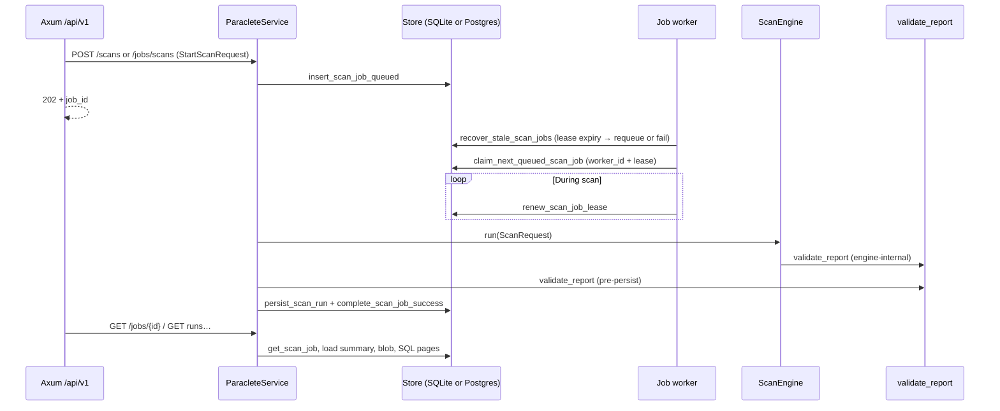

# Architecture

Paraclete is deliberately **engine-centric**: durable contracts and scan logic live in
Rust, while Python remains an **extension membrane** for custom diagnostics and
enrichers. Transport surfaces (HTTP, CLI, TUI) are intentionally **downstream** of the
engine so the same core can be embedded in services, libraries, and local tools without
forking behavior.

## Rust core + Python plugins

The Rust workspace owns:

- scan planning and orchestration seams
- format detection and future adapters
- dataset inventory and profiling contracts
- rule evaluation (native rules first)
- structured findings, evidence, and reports

The Python package (`python/paraclete_plugins/`) owns:

- **declarative manifests** and capability metadata for third-party extensions
- Pydantic models mirroring a **subset** of the Rust plugin protocol
- future execution helpers (subprocess, shared memory, or RPC — **not chosen in Phase 0**)

Rust remains the **source of truth** for serialized scan reports and core findings.
Python may emit *additional* contributions that the engine normalizes into the shared
finding model in later phases.

## Engine before HTTP

An HTTP API is a **projection** of engine capabilities. If the engine cannot run as a
library with stable contracts, the API will ossify around accidental transport details.

Phase 0 established the workspace skeleton; **Phase 3** hardened **`ScanEngine::run`** with
**per-asset outcomes** (`AssetRecord`), **bounded probe metadata** for text, **grouping vs
partition layout** on `Dataset`, and **schema-aware** Parquet grouping. **Phase 4** added
**`paraclete-store`**: SQLite migrations, **canonical report blobs**, **relational projections**,
**run identity** (`RunId` vs `scan_id`), **typed `FailureKind`**, **redaction policy**, and
**`diff_reports`**. **Phase 5** adds **`paraclete-service`**: **`ParacleteService`** orchestrates engine
+ store, and **Axum** exposes **`/api/v1`** (read-heavy, paginated, OpenAPI JSON) without coupling
the engine to HTTP. **Phase 6** adds **`scan_jobs`** and an **in-process worker** so HTTP can **enqueue**
scans (**`202`**) while the same **`execute_scan_and_persist`** path materializes **`scan_runs`**; **`POST /scans/sync`**
remains for synchronous dev/tests (**`201`**).

- `paraclete-types` — durable contracts, namespaced finding codes, scan plans, evidence shape, asset accounting, run/diff/redaction types
- `paraclete-core` — local resolution, Parquet footer reads, dataset inference (anchor + schema + part-file hints), shallow text, built-in rules
- `paraclete-store` — SQLite + Postgres persistence: runs, JSON blobs, projections, scan jobs, **`auth_tokens`**, **`StoreBackend`**
- `paraclete-service` — application service + Axum HTTP + OpenAPI (`paraclete-http` binary)
- `paraclete-cli` — `paraclete` terminal client over `/api/v1` only (no local engine/store in normal use)
- `paraclete-report` — JSON + Markdown stubs + validation helpers
- `paraclete-plugin-protocol` — extension boundary types (execution still deferred)

HTTP arrives only after scan execution, inventory modeling, and report stability are
proven in-process.

## Component diagram

## Authentication (Phase 9)

**Axum middleware** (nested under **`/api/v1`**) validates **`Authorization: Bearer`**, loads a row from
**`auth_tokens`** by **SHA-256** hash, checks **role** against a small route policy, and attaches
**`AuthPrincipal`** to the request. Handlers remain free of ad hoc auth checks; **`GET /api/v1/health`**
is mounted **outside** the protected nest. See **`docs/phase-9.md`** and ADRs **0015**–**0016**.

## Token administration (Phase 11)

**Admin-only** routes under **`/api/v1/admin/tokens`** are authorized by the same Bearer middleware with
**`AuthRole::Admin`**. **`ParacleteService`** implements create/list/get/disable/**rotate**; the active store (**`StoreBackend`**: SQLite or Postgres)
persists hashes, optional **`note`**, **`last_used_at`**, **`replaced_by_token_id`**, and a short **`token_prefix`**
for listing. Successful **`verify_bearer_token`** updates **`last_used_at`**. Handlers stay thin;
audit emits **`token.created`**, **`token.disabled`**, and **`token.rotated`** without secrets. See **`docs/phase-11.md`**,
**`docs/phase-16.md`**, and ADRs **0019**–**0020**, **0027**–**0028**.

## OpenAPI contract (Phase 12)

**`GET /api/v1/openapi.json`** is generated from **`utoipa`**: **`ApiDoc`** in **`openapi/mod.rs`** composes
**`#[utoipa::path]`** stubs (**`openapi/paths.rs`**) with schemas derived from Rust types (**`utoipa::ToSchema`**
on DTOs and shared JSON shapes, **`utoipa::IntoParams`** for `Query` structs). **`bearerAuth`** is
registered via a **`Modify`** hook. This keeps the published contract aligned with serde field names and
enums; see **`docs/phase-12.md`** and ADRs **0021**–**0022**.

## Persistence (Phase 15 + Phase 17)

**SQLite**: **`SqliteScanStore::connect`** (defaults) or **`connect_with_config`**
(**`SqliteStoreConfig`** in `crates/paraclete-store/src/sqlite_config.rs`). Connections use **WAL**,
**`synchronous=NORMAL`** (with WAL), **`foreign_keys=ON`**, a **5s** busy timeout, and a small pool (**5**).
Migrations live under **`crates/paraclete-store/migrations/`**; see **`migrations/README.md`**.

**Postgres**: **`PostgresScanStore::connect`** applies **`migrations/postgres/`**. **`PARACLETE_DATABASE_URL`** starting with
**`postgres://`** or **`postgresql://`** selects Postgres; otherwise SQLite (**`paraclete-http`** uses **`StoreBackend::connect`**).

**`ParacleteService`** depends on **`StoreBackend`** (no SQL in the service crate). See **`docs/postgres-sqlite-compatibility.md`**,
ADR **0026**, **0029**, **0030**. **Backup (SQLite)**: treat **`-wal`** / **`-shm`** files as part of the database state or use SQLite’s backup API.

## Terminal UI (Phase 13)

**`paraclete-tui`** is a **ratatui** front-end that uses **`paraclete_cli::ApiClient`** only: the same
**`reqwest`** wrapper and JSON DTOs as the **`paraclete`** CLI. It does not open SQLite or construct
**`ParacleteService`** locally. Session state (URL, token) stays in memory unless set via environment
variables. See **`docs/phase-13.md`** and ADRs **0023**–**0024**.

## Observability (Phase 10)

**Prometheus** metrics are recorded via the **`metrics`** crate and scraped from **`GET /metrics`**
(unauthenticated by default; protect at the edge in production — see ADR **0018**). **HTTP middleware**
records request duration and counts with **normalized routes**; **`X-Request-Id`** correlates responses.
**Audit-style** lines use **`tracing`** with **`target = "paraclete_audit"`** and stable **`event`**
names (tokens are never logged). **`ParacleteService`** times scan engine and persist paths; the **worker**
emits job lifecycle, lease renewal, and stale-recovery metrics and a **`paraclete.job`** span. Store
failures increment **`paraclete_store_errors_total{kind}`** from **`AppError`**. See **`docs/phase-10.md`**
and ADRs **0017**–**0018**.

## Data flow (Phase 6: async scans → jobs → worker → engine + store)

Synchronous **`POST /scans/sync`** skips the queue and follows the same **`execute_scan_and_persist`**
body as the worker.

The older `ScanOrchestrator` remains useful for **trait-level smoke tests** only; full local
reports should use **`ScanEngine::run`**.

## Format tiers

Paraclete distinguishes **support depth**, not binary on/off support:

| Tier            | Meaning                                                                 |
|-----------------|-------------------------------------------------------------------------|
| `first_class`   | Deepest diagnostics; Parquet row groups, statistics, and footguns first |
| `second_class`  | Shared abstractions with fewer guarantees (CSV, JSON, NDJSON early)      |
| `experimental`  | Exploratory surfaces; contracts may evolve quickly                       |

This is a **policy statement** carried by `DataFormat::default_support_tier()` and enforced
more rigorously once adapters land. **Abstractions must tolerate uneven depth**: Parquet
receives full footer inspection, while CSV/JSON paths receive **bounded shallow reads** in
Phase 2 (informational findings) until dedicated parsers arrive.

## Repository layout (engineering view)

- `crates/paraclete-types` — durable JSON-friendly contracts
- `crates/paraclete-core` — engine traits + orchestrator skeleton
- `crates/paraclete-store` — SQLite scan history (runs, blobs, projections, diff helpers, hardened connection defaults)
- `crates/paraclete-service` — `ParacleteService` + Axum HTTP + OpenAPI
- `crates/paraclete-report` — JSON + Markdown render stubs + validation helpers
- `crates/paraclete-plugin-protocol` — Rust ↔ Python protocol structs + executor trait
- `python/paraclete_plugins` — Pydantic mirrors + future plugin packages
- `fixtures/` — tiny CSV/JSON/Parquet/report samples for tests and docs
- `docs/` — architecture + ADRs + living implementation log
