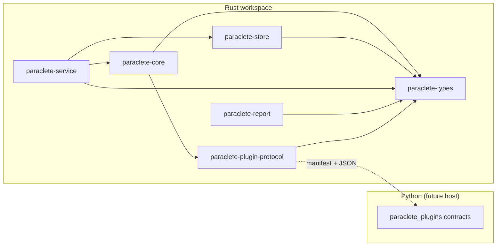
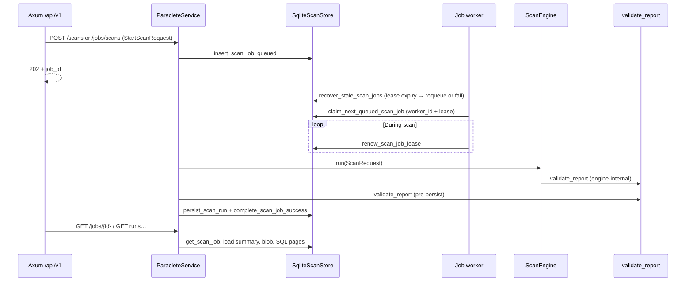

# Architecture

Paraclete is deliberately **engine-centric**: durable contracts and scan logic live in
Rust, while Python remains an **extension membrane** for custom diagnostics and
enrichers. Transport surfaces (HTTP, CLI, TUI) are intentionally **downstream** of the
engine so the same core can be embedded in services, libraries, and local tools without
forking behavior.

## Rust core + Python plugins

The Rust workspace owns:

- scan planning and orchestration seams
- format detection and future adapters
- dataset inventory and profiling contracts
- rule evaluation (native rules first)
- structured findings, evidence, and reports

The Python package (`python/paraclete_plugins/`) owns:

- **declarative manifests** and capability metadata for third-party extensions
- Pydantic models mirroring a **subset** of the Rust plugin protocol
- future execution helpers (subprocess, shared memory, or RPC — **not chosen in Phase 0**)

Rust remains the **source of truth** for serialized scan reports and core findings.
Python may emit *additional* contributions that the engine normalizes into the shared
finding model in later phases.

## Engine before HTTP

An HTTP API is a **projection** of engine capabilities. If the engine cannot run as a
library with stable contracts, the API will ossify around accidental transport details.

Phase 0 established the workspace skeleton; **Phase 3** hardened **`ScanEngine::run`** with
**per-asset outcomes** (`AssetRecord`), **bounded probe metadata** for text, **grouping vs
partition layout** on `Dataset`, and **schema-aware** Parquet grouping. **Phase 4** added
**`paraclete-store`**: SQLite migrations, **canonical report blobs**, **relational projections**,
**run identity** (`RunId` vs `scan_id`), **typed `FailureKind`**, **redaction policy**, and
**`diff_reports`**. **Phase 5** adds **`paraclete-service`**: **`ParacleteService`** orchestrates engine
+ store, and **Axum** exposes **`/api/v1`** (read-heavy, paginated, OpenAPI JSON) without coupling
the engine to HTTP. **Phase 6** adds **`scan_jobs`** and an **in-process worker** so HTTP can **enqueue**
scans (**`202`**) while the same **`execute_scan_and_persist`** path materializes **`scan_runs`**; **`POST /scans/sync`**
remains for synchronous dev/tests (**`201`**).

- `paraclete-types` — durable contracts, namespaced finding codes, scan plans, evidence shape, asset accounting, run/diff/redaction types
- `paraclete-core` — local resolution, Parquet footer reads, dataset inference (anchor + schema + part-file hints), shallow text, built-in rules
- `paraclete-store` — SQLite persistence: runs, JSON blobs, asset/dataset/finding projections, scan jobs queue, integrity helper
- `paraclete-service` — application service + Axum HTTP + OpenAPI (`paraclete-http` binary)
- `paraclete-cli` — `paraclete` terminal client over `/api/v1` only (no local engine/store in normal use)
- `paraclete-report` — JSON + Markdown stubs + validation helpers
- `paraclete-plugin-protocol` — extension boundary types (execution still deferred)

HTTP arrives only after scan execution, inventory modeling, and report stability are
proven in-process.

## Component diagram

## Data flow (Phase 6: async scans → jobs → worker → engine + store)

Synchronous **`POST /scans/sync`** skips the queue and follows the same **`execute_scan_and_persist`**
body as the worker.

The older `ScanOrchestrator` remains useful for **trait-level smoke tests** only; full local
reports should use **`ScanEngine::run`**.

## Format tiers

Paraclete distinguishes **support depth**, not binary on/off support:

| Tier            | Meaning                                                                 |
|-----------------|-------------------------------------------------------------------------|
| `first_class`   | Deepest diagnostics; Parquet row groups, statistics, and footguns first |
| `second_class`  | Shared abstractions with fewer guarantees (CSV, JSON, NDJSON early)      |
| `experimental`  | Exploratory surfaces; contracts may evolve quickly                       |

This is a **policy statement** carried by `DataFormat::default_support_tier()` and enforced
more rigorously once adapters land. **Abstractions must tolerate uneven depth**: Parquet
receives full footer inspection, while CSV/JSON paths receive **bounded shallow reads** in
Phase 2 (informational findings) until dedicated parsers arrive.

## Repository layout (engineering view)

- `crates/paraclete-types` — durable JSON-friendly contracts
- `crates/paraclete-core` — engine traits + orchestrator skeleton
- `crates/paraclete-store` — SQLite scan history (runs, blobs, projections, diff helpers)
- `crates/paraclete-service` — `ParacleteService` + Axum HTTP + OpenAPI
- `crates/paraclete-report` — JSON + Markdown render stubs + validation helpers
- `crates/paraclete-plugin-protocol` — Rust ↔ Python protocol structs + executor trait
- `python/paraclete_plugins` — Pydantic mirrors + future plugin packages
- `fixtures/` — tiny CSV/JSON/Parquet/report samples for tests and docs
- `docs/` — architecture + ADRs + living implementation log
