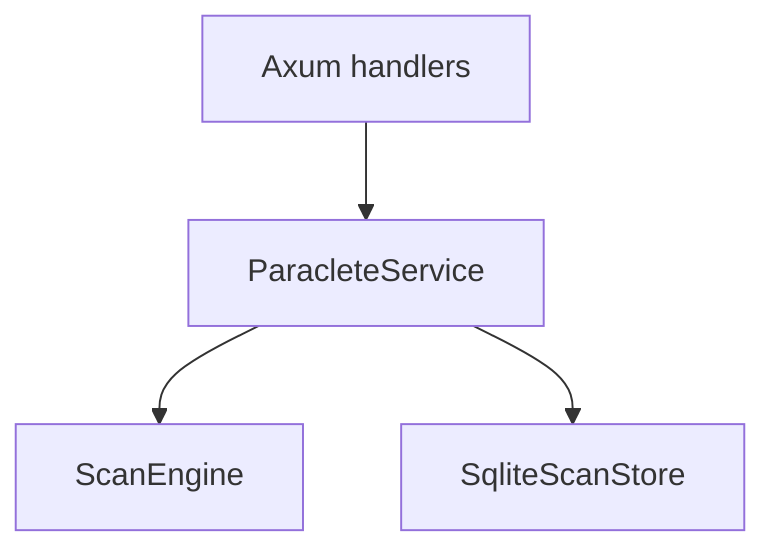

# Phase 5 — Application service layer and HTTP API MVP

Phase 5 adds a **thin, test-backed HTTP surface** over existing **`ScanEngine`** + **`SqliteScanStore`**, with a mandatory **`ParacleteService`** application boundary so transport does not improvise persistence or scanning.

## 1. Summary

End-to-end today:

- **`ParacleteService`** owns use cases: start scan + persist, run summary, full report, paginated assets/findings, list runs by target, diff two runs.
- **Axum** serves **`/api/v1/*`** with **gzip/brotli/deflate** (`tower-http` compression), **request tracing**, and a **300s** request timeout (returns **408** on timeout).
- **Stable JSON errors** (`error.code`, `error.message`, `error.details`) via **`AppError`** / **`IntoResponse`**.
- **OpenAPI 3.1** document at **`GET /api/v1/openapi.json`** (paths + summaries; detailed request/response schemas can grow later).
- **Pagination** for assets and findings: `limit` (default 50, max 500), `offset`, deterministic ordering (`path` / `fingerprint` ascending).
- **Persistence default**: when `POST /api/v1/scans` omits `redaction`, **`RedactionPolicy::transport_safe_persist()`** is applied before storage (see Phase 4 types).

## 2. Files added or changed (this phase)

| Area | Paths |
|------|--------|
| New crate | `crates/paraclete-service/` (`Cargo.toml`, `src/lib.rs`, `src/error.rs`, `src/api_types.rs`, `src/service.rs`, `src/http/mod.rs`, `src/http/handlers.rs`, `src/openapi/`, `src/bin/paraclete-http.rs`, `tests/http_api.rs`) |
| Store | `migrations/20250416100000_run_summary_json.sql`, `sqlite_store.rs` (`summary_json` on persist, `get_run_public_meta`, `load_stored_scan_summary`, asset/finding counts + pages, `Stored*` rows, `RunPublicMeta`), `labels.rs` (`parse_data_format`), `lib.rs` exports |
| Types | `run.rs` (`RedactionPolicy::transport_safe_persist`) |
| Workspace | Root `Cargo.toml` (member, axum, tower, tower-http, utoipa, hyper, http-body-util, urlencoding) |
| Docs | `README.md`, `docs/architecture.md`, `docs/domain-model.md`, `docs/implementation-log.md`, `docs/phase-5.md`, `docs/adr/0007-*.md`, `mkdocs.yml` |

## 3. Application architecture



- **Handlers** (`http/handlers.rs`) only call **`ParacleteService`**.
- **`ParacleteService`** (`service.rs`) sequences validation, engine run, redaction choice, store persist, and read paths.
- **Store** gained **`summary_json`** so **`GET /api/v1/runs/{id}`** can return a **run summary without loading `report_json`**.

## 4. API surface

| Method | Path | Notes |
|--------|------|--------|
| GET | `/api/v1/health` | Liveness |
| GET | `/api/v1/openapi.json` | OpenAPI document |
| POST | `/api/v1/scans` | Body: `StartScanRequest` (`target`, `profile`, optional `options`, optional `scan_id`, optional `redaction`). **201** + `StartScanResponse`. **Synchronous** scan. |
| GET | `/api/v1/runs/{run_id}` | **`RunSummaryView`** (header + `ScanSummary` + `report_sha256`) |
| GET | `/api/v1/runs/{run_id}/report` | Full **`ScanReport`** JSON |
| GET | `/api/v1/runs/{run_id}/assets` | Query: `limit`, `offset`, optional `inspection_status` (`inspected` / `failed` / `skipped`) |
| GET | `/api/v1/runs/{run_id}/findings` | Query: `limit`, `offset`, optional `severity`, optional `code` (exact match) |
| GET | `/api/v1/targets/{target_kind}/runs` | Query: **`normalized_key`** (required), `limit` (default 50, clamped 1–500). Unknown `target_kind` → **404** `target_not_found`. |
| GET | `/api/v1/diff` | Query: `left_run_id`, `right_run_id` → **`RunDiff`** |

**Binary**: `paraclete-http` reads **`PARACLETE_DATABASE_URL`** (SQLite URI, e.g. `sqlite:///tmp/p.db`) and **`PARACLETE_HTTP_ADDR`** (default `0.0.0.0:8080`).

## 5. Error model

Envelope:

```json
{ "error": { "code": "run_not_found", "message": "...", "details": {} } }
```

Codes:

| Code | Typical HTTP | When |
|------|----------------|------|
| `invalid_request` | 400 | Bad JSON shape, bad query, unsupported local-engine constraints surfaced as validation |
| `run_not_found` | 404 | Unknown `run_id` in store |
| `target_not_found` | 404 | Unknown `target_kind` for list route; missing path for scan (`CoreError::MissingPath`) |
| `scan_failed` | 422 | Engine failures (I/O, Parquet, inspect, etc.) except those mapped above |
| `store_error` | 500 | SQLite/serde failures other than not-found |
| `internal_error` | 500 | Reserved / unexpected |

Axum JSON parse failures may return **400/422** without the Paraclete envelope (framework behavior).

## 6. Persistence interaction

- **POST /scans**: `ScanEngine::run` → `validate_report` → `persist_scan_run` with chosen redaction (default transport-safe).
- **GET run summary**: `get_run_public_meta` reads **`scan_runs`** row including **`summary_json`** (falls back to loading report only if summary JSON is legacy-invalid).
- **GET report**: `load_report` (full blob).
- **GET assets/findings**: paginated SQL over projection tables only.

## 7. OpenAPI

- Evolved in Phase 12 to **`utoipa::OpenApi`** + path stubs (`crates/paraclete-service/src/openapi/`); Phase 5 originally used **`OpenApiBuilder`**.
- Served as JSON from **`GET /api/v1/openapi.json`** (same router as the API).
- Tests assert presence of key paths (`/api/v1/health`, `/api/v1/scans`, `/api/v1/diff`).

## 8. Tests added

- `crates/paraclete-service/tests/http_api.rs`: health, OpenAPI path keys, full scan→persist→summary/report/assets/findings→diff flow, run not found, invalid JSON, unknown target kind, target listing.

## 9. Validation commands

```bash
cargo fmt --all -- --check
cargo clippy --workspace --all-targets --all-features -- -D warnings
cargo test --workspace
```

Python unchanged unless you extend plugins.

## 10. Deferred items

- Real **auth/authz** (stubs only by design).
- **CLI / TUI**, object-store scanning, plugins, scheduling, CI/CD, websockets.
- Rich OpenAPI **schemas** for every body (currently path summaries + operational behavior).
- **Cursor-based** pagination, streaming bodies, and background scan jobs.
- Mapping **all** Axum rejections into the Paraclete error envelope.

## What helps create the next prompt

- **CLI/TUI readiness:** HTTP now exposes the same operations a thin CLI would call; synchronous scans are still heavy for huge trees—**async jobs** may precede a polished CLI if scans exceed HTTP timeouts.
- **Still synchronous/heavy:** `POST /api/v1/scans` runs the full engine inline; large directories risk **408** at the transport timeout unless callers raise limits or you add job ids.
- **Auth / multi-tenant pressure:** `TargetIdentity` remains shallow; listing by raw `normalized_key` without auth is fine locally but becomes sensitive once exposed beyond localhost.
- **Next phase candidates:** **CLI** wrapping `ParacleteService` + same store URL; **async job queue** if HTTP hosts need non-blocking scans; **persistence refinement** (checksum/versioned migrations, sqlx offline) if CI hardening matters more than UX.
- **Fragile transport assumptions:** query-string **`normalized_key`** must be **percent-encoded** for arbitrary UTF-8 paths; diff still fingerprint-centric; compression behavior depends on client `Accept-Encoding`.
